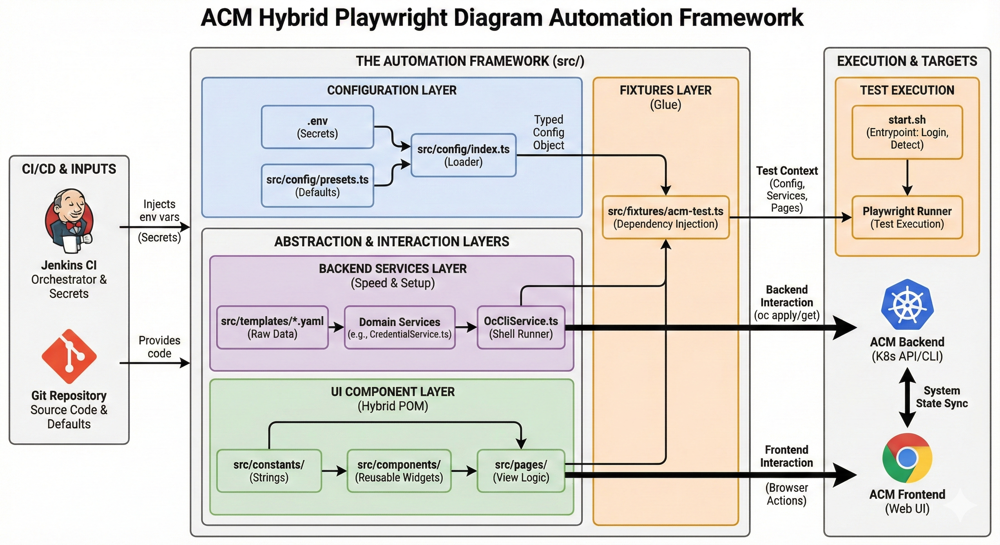

# 🏗 ACM Automation Architecture Reference



This project follows a **Domain-Driven, Hybrid Testing Architecture**. We separate **"Test Intent"** (what we want to verify) from **"Implementation Details"** (how we click buttons or run CLI commands).

## 📂 Directory Structure Overview

```text
/src
├── /config            # Configuration & Environment Variables
├── /constants         # Static Strings (URLs, Selectors, Text)
├── /services          # Backend Logic (OC CLI, API Wrappers)
├── /utils             # Pure Functions (Parsing, Math, Formatting)
├── /components        # Reusable UI Widgets (Tables, Modals)
├── /pages             # Page Objects (Views that use Components)
├── /lib               # Complex Test Logic (Factories, Assertions)
├── /fixtures          # Test Runner Extensions (Dependency Injection)
└── /tests             # Executable Test Specs
```

A more comprehensive example:

```text
/acm-e2e-automation
├── .env                    <-- Secrets (API Tokens, Passwords). Gitignored.
├── .env.example            <-- Template for new developers.
├── .gitignore              <-- Ignore node_modules, test-results, .env, temp/.
├── .nvmrc                  <-- Enforces Node version (e.g., "20").
├── Dockerfile              <-- CI Environment (Playwright + oc CLI).
├── compose.yaml            <-- Docker Compose for local isolated runs.
├── package.json            <-- Scripts call ./start.sh.
├── playwright.config.ts    <-- The "Mixer" (Env + Presets + Projects).
├── start.sh                <-- Entrypoint: Auto-login, Version Detect, Test Runner.
├── tsconfig.json           <-- Strict Mode & Path Aliases (@utils, @pages, etc).
│
├── .github
│   └── workflows           <-- CI/CD
│       └── lint-and-test.yml <-- Runs ESLint & Typecheck on PRs.
│
├── .vscode               
│   ├── extensions.json     <-- Recommends ESLint, Prettier.
│   └── settings.json       <-- Auto-format on save settings.
│
└── /src                    <-- Source Code
    │
    ├── /config             <-- Configuration Layer
    │   ├── presets.ts      <-- Shared Defaults (Regions, User Roles).
    │   ├── schema.ts       <-- TypeScript Interfaces for Config.
    │   └── index.ts        <-- Loader: Merges .env > Presets > Detected OCP Version.
    │
    ├── /constants          <-- "Source of Truth"
    │   ├── common.ts       <-- Global texts (Save, Cancel, Toast msgs).
    │   ├── cluster.ts      <-- Provider names, Statuses.
    │   ├── selectors.ts    <-- Versioned CSS selectors (v4.12 vs v4.14).
    │   └── routes.ts       <-- Central URL definitions.
    │
    ├── /services           <-- Backend Logic (No UI)
    │   ├── AuthService.ts       <-- Login logic (Token fetching, Cookie hijacking).
    │   ├── OcCliService.ts      <-- Wraps `oc` commands & `applyYaml`.
    │   └── /domains
    │       ├── CredentialService.ts <-- "Ensure Credential Exists".
    │       └── ClusterService.ts    <-- CLI checks for provisioning status.
    │
    ├── /templates          <-- Raw Data (YAMLs with placeholders)
    │   ├── /credentials
    │   ├── /policies
    │   └── install-config.yaml
    │
    ├── /utils              <-- "Dumb" Helpers (Pure Functions)
    │   ├── fs-helper.ts         <-- YAML parsing, Temp file cleanup.
    │   ├── data-helper.ts       <-- Date formatting, String manipulation.
    │   └── kube-helper.ts       <-- Version parsing, Safe Name generation.
    │
    ├── /components         <-- UI Widgets (The "Legos")
    │   ├── /common              <-- Global UI (Used across domains)
    │   │   ├── FeedbackModal.ts
    │   │   ├── ExportButton.ts
    │   │   └── ToastNotification.ts
    │   │
    │   ├── /patternfly          <-- Low-level Wrappers (Resilience Layer)
    │   │   ├── PfSelect.ts      <-- Dropdown logic (v4/v5 compatible).
    │   │   └── PfTable.ts       <-- Pagination/Sort logic.
    │   │
    │   ├── AcmTable.ts          <-- Extends PfTable with ACM logic.
    │   ├── AcmModal.ts
    │   └── WizardStepper.ts
    │
    ├── /pages              <-- Views (Assemble Components)
    │   ├── BasePage.ts     <-- Global Nav, User Menu, "Wait for Load".
    │   ├── /cluster
    │   │   ├── ClusterListPage.ts
    │   │   └── CreateClusterWizard.ts
    │   ├── /policy
    │   │   └── PolicyPage.ts
    │   └── /common
    │       └── Navigation.ts
    │
    ├── /lib                <-- "Smart" Logic (Assertions & Factories)
    │   ├── /assertions          <-- Reusable Verification
    │   │   └── FileAssertions.ts  <-- expectValidCsv().
    │   ├── UserFactory.ts       <-- API User Factory (Dynamic RBAC API).
    │   └── UiUserFactory.ts     <-- UI User Factory (Dynamic Browser Contexts).
    │
    ├── /fixtures           <-- Dependency Injection (The Glue)
    │   ├── acm-test.ts     <-- The Master Fixture. Injects Config, Services, Pages.
    │   └── base.ts
    │
    └── /tests              <-- Execution (Pure Specs - No Logic Here!)
        ├── /cluster
        │   ├── create-aws.spec.ts
        │   └── list-export.spec.ts
        ├── /policy
        │   ├── governance-e2e.spec.ts
        │   └── list-export.spec.ts
        └── /app
            ├── matrix-api.spec.ts
            └── matrix-ui.spec.ts
```

## 📚 Directory Deep Dive

### 1. `/src/config` (The Control Center)

**Purpose:** Manages how the test suite runs in different environments (Local vs. CI, ci, etc.).

- **`presets.ts`**: Defines default values for different teams or regions.
  - Example: `AWS_US_EAST_1` preset might set `workerCount: 5`.
- **`schema.ts`**: TypeScript interfaces defining what our config looks like.
- **`index.ts`**: The "Loader". It merges `.env` files, environment variables, and presets into a single `testConfig` object used by the tests.

**Rule:** Never access `process.env` directly in a test. Always access `testConfig.cluster.url`.

### 2. `/src/services` (The Backend Layer)

**Purpose:** Handles all interactions that do not involve a browser. This is the "Hybrid" part of the framework.

- **`OcCliService.ts`**: A wrapper around the `oc` command-line tool. It handles login, context switching, and raw command execution.
- **`AuthService.ts`**: Handles fetching tokens and "Cookie Hijacking" to bypass the slow UI login screen.
- **`/domains/*.ts`**: Domain-specific logic.
  - Example: `CredentialService.ts` checks if a cloud provider secret exists in a namespace. If not, it uses a YAML template to create it instantly.

**Rule:** If you need to "Setup" data (create a cluster, policy, or secret), use a Service. Do not use the UI wizard for setup unless the test is specifically testing the wizard.

### 3. `/src/components` (The UI Widgets)

**Purpose:** Reusable pieces of the UI. Think of these as "Legos."

- **`/common`**: Components that appear everywhere.
  - Files: `FeedbackModal.ts`, `ToastNotification.ts`, `ExportButton.ts`.
- **`/patternfly`**: Low-level wrappers for the UI library.
  - Why? PatternFly updates frequently break selectors. By isolating logic here (e.g., "How to select an item in a Dropdown"), we protect the rest of the suite from breaking changes.
  - Files: `PfSelect.ts` (Dropdowns), `PfTable.ts` (Grids).
- **`AcmTable.ts`**: Extends `PfTable` but adds ACM-specific logic (e.g., searching for a Cluster Name in the search bar).

**Rule:** A Component never knows "which page" it is on. It only knows how to interact with itself (e.g., "I am a table, I can sort my rows").

### 4. `/src/pages` (The Views)

**Purpose:** Represents a full screen or "View" in the application. A Page Object assembles multiple Components together.

- **`BasePage.ts`**: The parent class. It contains the Navigation Bar, User Menu, and the logic for `waitForLoad()` (waiting for spinners to vanish).
- **`/cluster/ClusterListPage.ts`**:
  - Contains: An `AcmTable` component, a `CreateClusterButton` locator.
  - Logic: "Go to this URL", "Click the Create button".
- **`/policy/PolicyPage.ts`**:
  - Contains: A `WizardStepper` component, Form inputs.

**Rule:** Page Objects should not contain complex assertions. They should expose data or state for the test to assert on.

### 5. `/src/lib` (Smart Logic)

**Purpose:** Helper classes that contain "Business Logic" for testing, but aren't strictly UI or Backend.

- **`/assertions`**: Reusable assertion logic.
  - Example: `FileAssertions.ts` has a function `expectValidCsv(download)` that checks if a downloaded file is valid.
- **`UserFactory.ts`**: Handles the complexity of RBAC (Role-Based Access Control). It dynamically spins up API contexts for "Editor", "Viewer", or "Admin" roles.
- **`UiUserFactory.ts`**: Similar to above, but spins up isolated Browser Contexts (Incognito windows) for testing multiple users in the UI simultaneously.

### 6. `/src/utils` (Pure Functions)

**Purpose:** "Dumb" helpers. Input -> Output. No side effects.

- **`kube-helper.ts`**: Logic to generate safe names (`test-cluster-x9z8`).
- **`fs-helper.ts`**: Logic to read/write/delete temporary YAML files.
- **`data-helper.ts`**: Regex parsing, Date formatting.

**Rule:** Code in utils should never import Playwright or the Config. It should be standard TypeScript/Node.js code.

### 7. `/src/fixtures` (The Dependency Injection)

**Purpose:** The "Glue" that connects everything. This is where we configure the Playwright Test Runner to automatically initialize our classes.

- **`acm-test.ts`**: The master fixture file.
  - It initializes `OcCliService`.
  - It creates a `uniqueName` for the test.
  - It sets up the `adminPage` (logged in) and `viewerPage` (logged in).
  - Usage: Tests import `test` from here, not from `@playwright/test`.

### 8. `/src/tests` (The Execution Layer)

**Purpose:** The script that actually runs.

**Rule:** Tests must be Simple and Declarative.

- **Bad Test**: Contains CSS selectors, hardcoded waits, or complex loops.
- **Good Test**: Reads like an English sentence.
  - **Setup**: "Admin creates a policy."
  - **Action**: "Viewer logs in and views the policy."
  - **Assert**: "Viewer cannot see the delete button."
